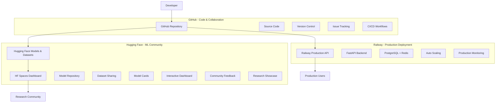

# 🌟 **HYBRID DEPLOYMENT STRATEGY**
## GitHub + Hugging Face + Railway Integration

Bu hibrit yaklaşım, modern ML projelerinde farklı platformların güçlü yanlarını birleştirerek optimal performans, topluluk erişimi ve production deployment sağlar.

---

## 🎯 **ARCHITECTURE OVERVIEW**



---

## 📁 **PLATFORM BREAKDOWN**

### 🐙 **GitHub - Code Repository & Collaboration**
**Role:** Primary development hub

**Responsibilities:**
- ✅ Source code version control
- ✅ Issue tracking & project management  
- ✅ CI/CD workflows
- ✅ Documentation & README
- ✅ Collaboration & code reviews
- ✅ Release management

**Repository:** https://github.com/RSMCTN/BIST_AI001

### 🤗 **Hugging Face - ML Models & Community**
**Role:** Machine learning artifact hosting & research community

**Responsibilities:**
- 🤖 Model weights & checkpoints storage
- 📊 Dataset hosting & versioning
- 📝 Model cards & documentation
- 🎛️ Interactive demos (Spaces)
- 👥 Community engagement
- 🔍 Discoverability & citations

**Models:**
- `RSMCTN/bist-dp-lstm-trading-dp_lstm_ensemble`
- `RSMCTN/bist-dp-lstm-trading-sentiment_model`
- `RSMCTN/bist-dp-lstm-trading-feature_selector`

**Datasets:**
- `RSMCTN/bist-dp-lstm-trading-bist_historical`
- `RSMCTN/bist-dp-lstm-trading-turkish_financial_news`

**Spaces:**
- `RSMCTN/bist-dp-lstm-trading-trading_dashboard`

### 🚂 **Railway - Production Deployment**
**Role:** High-performance production environment

**Responsibilities:**
- 🚀 Production API hosting
- 📈 Auto-scaling & load balancing
- 🗄️ Database management (PostgreSQL + Redis)
- 📊 Performance monitoring
- 🔒 Security & authentication
- 💰 Cost-effective scaling

**Services:**
- FastAPI backend
- PostgreSQL (relational data)
- Redis (caching)
- InfluxDB (time-series data)

---

## 🔄 **DEPLOYMENT WORKFLOW**

### 1. **Development Phase**
```bash
# Local development
git checkout -b feature/new-model
# ... develop & test ...
git push origin feature/new-model
# ... create PR & review ...
git merge main
```

### 2. **GitHub Integration**
```bash
# Push to main triggers workflows
git push origin main

# GitHub Actions automatically:
# ✅ Runs tests
# ✅ Builds Docker images  
# ✅ Updates documentation
# ✅ Creates releases
```

### 3. **Hugging Face Upload**
```bash
# Upload models & datasets
python scripts/huggingface_setup.py

# Or manual upload
huggingface-cli upload RSMCTN/bist-dp-lstm-model ./models/
huggingface-cli upload RSMCTN/bist-dataset ./data/processed/
```

### 4. **Railway Deployment**
```bash
# Deploy to production
python scripts/deploy_railway.py

# Or using Railway CLI
railway up
railway open  # Opens production URL
```

---

## 🎛️ **MANAGEMENT COMMANDS**

### **Setup Complete Hybrid Environment**
```bash
# 1. Install dependencies
pip install -r requirements.txt
pip install huggingface_hub[cli]
curl -fsSL https://railway.app/install.sh | sh

# 2. Authenticate
huggingface-cli login
railway login

# 3. Setup all platforms
python scripts/hybrid_deploy_all.py
```

### **Individual Platform Management**
```bash
# GitHub only
git push origin main

# Hugging Face only  
python scripts/huggingface_setup.py

# Railway only
python scripts/deploy_railway.py

# Update all platforms
python scripts/sync_platforms.py
```

---

## 📊 **MONITORING & ANALYTICS**

### **GitHub Metrics**
- ⭐ Stars & forks tracking
- 👥 Contributor engagement
- 📈 Code activity metrics
- 🐛 Issue resolution time

### **Hugging Face Metrics**
- 📥 Model download counts
- 👀 Dataset views & usage
- 💬 Community discussions
- 🔍 Search ranking

### **Railway Metrics**  
- 🚀 API response times
- 💾 Resource utilization
- 📊 Traffic patterns
- 💰 Cost optimization

---

## 🔒 **SECURITY & COMPLIANCE**

### **Differential Privacy**
- ✅ Model training with privacy guarantees
- 📊 Privacy budget tracking
- 🔒 Sensitive data protection

### **API Security**
- 🔐 Authentication & rate limiting
- 🛡️ Input validation
- 📝 Audit logging
- 🚨 Anomaly detection

### **Data Protection**
- 🔒 Encrypted storage
- 🌐 HTTPS everywhere
- 📋 GDPR compliance
- 🗑️ Data retention policies

---

## 💰 **COST OPTIMIZATION**

### **Platform Costs**
- **GitHub:** Free (open source)
- **Hugging Face:** Free tier + paid for large models
- **Railway:** Pay-per-usage (~$5-50/month)

### **Optimization Strategies**
- 🔄 Auto-scaling on Railway
- 📦 Model compression for HF
- 🗄️ Efficient data storage
- ⏰ Scheduled scaling

---

## 🚀 **DEPLOYMENT CHECKLIST**

### **Pre-Deployment**
- [ ] ✅ All tests passing
- [ ] 📝 Documentation updated
- [ ] 🏷️ Version tagged
- [ ] 🔒 Security review completed
- [ ] 📊 Performance benchmarks met

### **GitHub Deployment**
- [ ] 🔄 Code pushed to main
- [ ] 🤖 CI/CD pipeline green
- [ ] 📋 Release notes created
- [ ] 🏷️ Git tags updated

### **Hugging Face Deployment**
- [ ] 🤖 Models uploaded
- [ ] 📊 Datasets uploaded  
- [ ] 📝 Model cards complete
- [ ] 🎛️ Spaces functional
- [ ] 📋 Documentation updated

### **Railway Deployment**
- [ ] 🐳 Docker build successful
- [ ] 🗄️ Database migrations run
- [ ] 🌐 Environment variables set
- [ ] 🔍 Health checks passing
- [ ] 📊 Monitoring active

---

## 🎉 **SUCCESS METRICS**

### **Technical KPIs**
- **Uptime:** >99.9%
- **Response Time:** <200ms
- **Error Rate:** <0.1%
- **Deployment Time:** <10 minutes

### **Community KPIs**
- **HF Model Downloads:** >1000/month
- **GitHub Stars:** >100
- **Community Contributions:** >5 contributors
- **Research Citations:** >10

### **Business KPIs**
- **Signal Accuracy:** >68% (MVP) → >75% (Production)
- **Sharpe Ratio:** >2.0
- **Max Drawdown:** <15%
- **User Engagement:** >80% daily active

---

## 🔗 **QUICK LINKS**

- 🏠 **Main Repository:** https://github.com/RSMCTN/BIST_AI001
- 🤖 **HF Models:** https://huggingface.co/RSMCTN?search=bist-dp-lstm
- 📊 **HF Datasets:** https://huggingface.co/RSMCTN?search=bist&type=dataset
- 🎛️ **HF Spaces:** https://huggingface.co/spaces/RSMCTN/bist-dp-lstm-trading-trading_dashboard
- 🚂 **Production API:** https://bist-dp-lstm-trading.up.railway.app
- 📊 **API Docs:** https://bist-dp-lstm-trading.up.railway.app/docs

---

## 📞 **SUPPORT & CONTACT**

- **Issues:** [GitHub Issues](https://github.com/RSMCTN/BIST_AI001/issues)
- **Discussions:** [HF Community](https://huggingface.co/RSMCTN)
- **Email:** [Repository Contact](https://github.com/RSMCTN)

**🎯 Ready for hybrid deployment across all platforms! 🚀**
