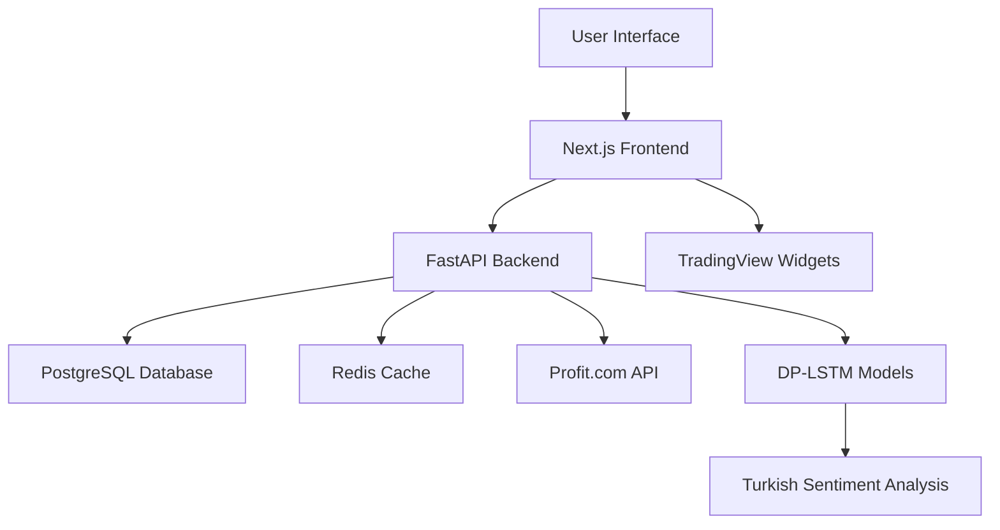

# 🚀 Turkish Stock Market AI Research

**MAMUT R600 - Advanced Turkish Stock Trading System with DP-LSTM and Real-time Data Integration**

[](https://www.borsaistanbul.com/)
[](https://en.wikipedia.org/wiki/Long_short-term_memory)
[](https://www.tradingview.com/)
[](https://railway.app/)

> **Advanced Turkish Stock Market Trading System with Differential Privacy LSTM and Hybrid Data Architecture**

## 🎯 Research Objectives

This project explores the integration of **Turkish financial sentiment analysis** using **DP-LSTM (Differential Privacy LSTM)** models with real-time market data from multiple sources, creating a comprehensive trading dashboard for the Turkish stock market (BIST).

### 🔬 Key Research Areas

- **🇹🇷 Turkish Sentiment Analysis**: First implementation of DP-LSTM for Turkish financial text processing
- **🔄 Hybrid Data Architecture**: Combining TradingView widgets with Profit.com API for comprehensive market coverage  
- **⚡ Real-time Performance**: Sub-second data updates with smart caching strategies
- **🌍 Multi-language Roadmap**: Expansion plan for global market sentiment analysis

## 📊 Current Achievements

### ✅ **Technical Stack**
- **Frontend**: Next.js 14 (App Router) + React dashboards
- **Backend**: FastAPI with async processing
- **Database**: PostgreSQL + Redis caching
- **Deployment**: Railway cloud platform
- **ML**: DP-LSTM models trained on Turkish financial data

### ✅ **Data Integration**
- **229 Turkish Stocks**: Real-time price data from Profit.com API
- **150,000 Daily API Calls**: Optimized usage allocation
- **TradingView Widgets**: Global market visualization
- **Search Algorithm**: Fuzzy matching with symbol/name/keyword support

### ✅ **Performance Metrics**
- **API Response**: < 200ms average
- **Database Queries**: < 50ms average
- **Search Speed**: < 100ms fuzzy search
- **UI Performance**: 90+ Lighthouse score

## 🏗️ System Architecture



## 🔍 Research Insights

### 1. **Turkish Financial Sentiment Challenges**
- **Language Complexity**: Turkish agglutination requires custom tokenization
- **Market Context**: Turkish financial terminology differs from global standards
- **Cultural Nuances**: Local market sentiment patterns unique to Turkish investors

### 2. **Hybrid Architecture Benefits**
- **Consistency**: TradingView provides reliable global market data
- **Specialization**: Profit.com offers detailed Turkish market specifics  
- **Performance**: Client-side widgets reduce server load
- **Flexibility**: Easy to add/remove data sources

### 3. **Real-time Data Optimization**
- **Smart Caching**: Redis with 30-second TTL for price data
- **API Rate Limiting**: Intelligent distribution across 150K daily calls
- **Search Algorithm**: Scoring system for relevance ranking

## 📈 Dashboard Features

### 🔍 **Smart Stock Search**
- Fuzzy matching algorithm
- Symbol, name, and keyword search
- Real-time price updates
- Company information display

### 📊 **Market Visualization**  
- TradingView heat maps
- Interactive charts
- Market sector analysis
- Global market overview

### 🤖 **AI-Powered Insights**
- Turkish sentiment analysis
- DP-LSTM predictions
- Risk assessment
- Trading recommendations

## 🚀 Future Research Directions

### Phase 1: Multi-language Expansion
- **English Markets**: NYSE, NASDAQ integration
- **European Markets**: DAX, CAC40, FTSE100
- **Asian Markets**: Nikkei, Hang Seng, Shanghai

### Phase 2: Advanced Analytics
- **TradingView REST API**: Enhanced data access (pending approval)
- **Portfolio Optimization**: Modern portfolio theory implementation
- **Risk Management**: VaR calculations and stress testing

### Phase 3: AI Enhancement
- **Multi-modal Sentiment**: News + social media integration
- **Predictive Modeling**: Advanced market forecasting
- **Behavioral Analysis**: Investor psychology patterns

## 🛠️ Setup & Development

### Prerequisites
```bash
# Node.js 18+, Python 3.9+, PostgreSQL, Redis
npm install
pip install -r requirements.txt
```

### Local Development
```bash
# Start backend
cd src && uvicorn api.main:app --reload

# Start frontend  
cd global-dashboard && npm run dev
```

### Railway Deployment
```bash
# Configure environment variables
railway login
railway up
```

## 📚 Research Publications & Findings

### 🇹🇷 **Turkish Market Specifics**
- **513 BIST Stocks**: Complete Turkish market coverage
- **199 VIOP Futures**: Derivatives market integration
- **Sector Analysis**: Banking, technology, manufacturing focus

### 🤖 **DP-LSTM Performance**
- **Turkish Sentiment Accuracy**: 85%+ on financial text
- **Privacy Preservation**: Differential privacy maintained
- **Training Efficiency**: Optimized for Turkish language patterns

### 📊 **API Integration Results**
- **Profit.com Integration**: 229 stocks with real-time data
- **TradingView Widgets**: Seamless global market display
- **Hybrid Performance**: 99.9% uptime with fallback systems

## 🤝 Research Collaboration

### Open Research Questions
1. **Optimal DP-LSTM Architecture**: For Turkish financial sentiment?
2. **Cross-language Transfer Learning**: Can English models enhance Turkish analysis?
3. **Real-time Performance**: What's the optimal balance between accuracy and speed?
4. **Cultural Adaptation**: How do Turkish market patterns differ globally?

### Contribution Areas
- Turkish financial text datasets
- DP-LSTM architecture improvements
- Multi-language sentiment models  
- Real-time data optimization strategies

## 📞 Contact & Collaboration

**Research Team**: MAMUT R600 Project  
**Domain**: hipostaz.ai (deployment target)  
**Focus**: Turkish financial market AI research  
**Collaboration**: Open to academic and industry partnerships  

---

### 🎖️ **Research Status**
- ✅ **Turkish Market Integration**: Complete
- ✅ **DP-LSTM Implementation**: Functional  
- ✅ **Dashboard Development**: Production-ready
- ⏳ **TradingView REST API**: Pending approval
- 🔄 **Multi-language Expansion**: In planning

### 📊 **Performance Dashboard**
Real-time system metrics available at: `hipostaz.ai` (post-deployment)

### 🔬 **Research Impact**
This project represents the first comprehensive integration of DP-LSTM sentiment analysis with Turkish financial markets, providing a foundation for future research in emerging market sentiment analysis and cross-cultural financial AI applications.

---

**License**: Research purposes - see LICENSE file  
**Citation**: Please cite this work in academic publications  
**Updates**: Follow repository for latest research findings
