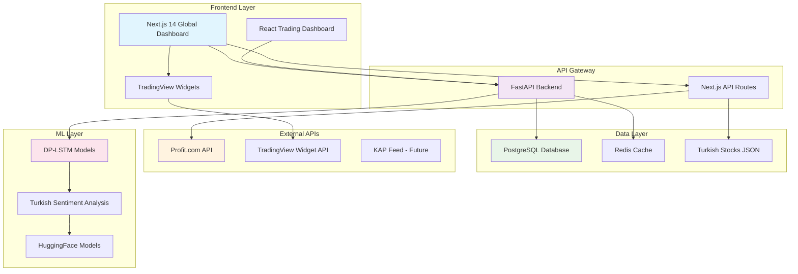
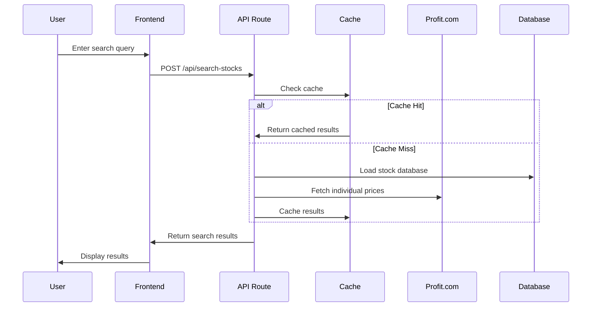
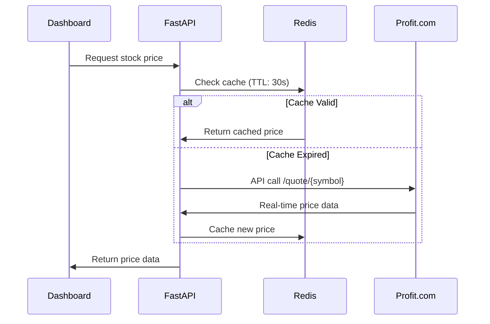
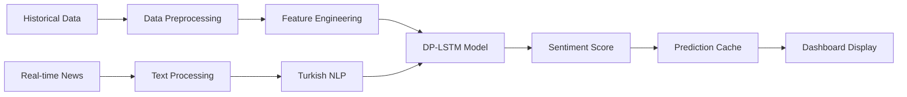

# 🏗️ MAMUT R600 - System Architecture

## 📊 High-Level Architecture



## 🔧 Component Architecture

### 1. **Frontend Architecture**

#### Next.js 14 Global Dashboard (`/global-dashboard/`)
```
src/
├── app/                    # App Router (Next.js 14)
│   ├── page.tsx           # Main dashboard page
│   ├── layout.tsx         # Root layout
│   └── globals.css        # Global styles
├── components/
│   ├── api-stock-search.tsx    # Smart search component
│   ├── market-selector.tsx     # Market selection
│   ├── tradingview/           # TradingView widgets
│   │   ├── market-overview.tsx
│   │   └── advanced-chart.tsx
│   └── ui/                    # Shadcn/ui components
└── api/                       # Next.js API routes
    └── search-stocks/
        └── route.ts          # Stock search endpoint
```

#### React Trading Dashboard (`/trading-dashboard/`)
```
src/
├── components/
│   ├── trading/              # Trading-specific components
│   │   ├── AIDecisionSupport.tsx
│   │   ├── ProfessionalStockChart.tsx
│   │   └── CompanyInfoCard.tsx
│   └── layout/               # Layout components
├── pages/                    # React Router pages
├── hooks/                    # Custom React hooks
└── utils/                    # Utility functions
```

### 2. **Backend Architecture**

#### FastAPI Backend (`/src/`)
```
src/
├── api/
│   ├── main.py               # FastAPI main application
│   ├── main_railway.py       # Railway-specific config
│   └── routes/               # API route handlers
├── models/                   # ML model definitions
│   ├── dp_lstm.py           # DP-LSTM implementation
│   └── sentiment_model.py    # Turkish sentiment model
├── services/                 # Business logic
│   ├── stock_service.py     # Stock data service
│   ├── ml_service.py        # ML predictions
│   └── cache_service.py     # Redis caching
└── utils/
    ├── database.py          # Database connections
    └── config.py            # Configuration management
```

### 3. **Data Architecture**

#### Database Schema (PostgreSQL)
```sql
-- Turkish stocks comprehensive data
CREATE TABLE turkish_stocks (
    id SERIAL PRIMARY KEY,
    symbol VARCHAR(10) UNIQUE NOT NULL,
    name VARCHAR(255) NOT NULL,
    sector VARCHAR(100),
    price DECIMAL(10,4),
    change_percent DECIMAL(5,2),
    volume BIGINT,
    market_cap BIGINT,
    updated_at TIMESTAMP DEFAULT CURRENT_TIMESTAMP
);

-- Historical price data for ML training
CREATE TABLE historical_prices (
    id SERIAL PRIMARY KEY,
    symbol VARCHAR(10) REFERENCES turkish_stocks(symbol),
    date DATE NOT NULL,
    open_price DECIMAL(10,4),
    high_price DECIMAL(10,4),
    low_price DECIMAL(10,4),
    close_price DECIMAL(10,4),
    volume BIGINT,
    UNIQUE(symbol, date)
);

-- Sentiment analysis results
CREATE TABLE sentiment_analysis (
    id SERIAL PRIMARY KEY,
    symbol VARCHAR(10) REFERENCES turkish_stocks(symbol),
    text_source VARCHAR(50), -- 'news', 'social', 'kap'
    sentiment_score DECIMAL(3,2), -- -1 to 1
    confidence DECIMAL(3,2),
    created_at TIMESTAMP DEFAULT CURRENT_TIMESTAMP
);
```

#### Redis Caching Strategy
```python
# Cache keys and TTL
CACHE_KEYS = {
    "stock_search_results": 30,      # 30 seconds
    "individual_stock_data": 60,     # 1 minute
    "market_overview": 300,          # 5 minutes
    "sentiment_analysis": 900,       # 15 minutes
    "ml_predictions": 1800,          # 30 minutes
}
```

## 🔄 Data Flow

### 1. **Stock Search Flow**


### 2. **Real-time Price Updates**


### 3. **ML Prediction Pipeline**


## 🚀 Deployment Architecture

### Railway Deployment
```yaml
# railway.json
{
  "version": 2,
  "build": {
    "builder": "DOCKERFILE",
    "dockerfilePath": "Dockerfile.railway"
  },
  "deploy": {
    "startCommand": "uvicorn src.api.main_railway:app --host 0.0.0.0 --port $PORT",
    "healthcheckPath": "/health",
    "healthcheckTimeout": 100
  }
}
```

### hipostaz.ai Deployment Plan
```yaml
# docker-compose.yml for hipostaz.ai
version: '3.8'
services:
  frontend:
    build: ./global-dashboard
    ports:
      - "3000:3000"
    environment:
      - NEXT_PUBLIC_API_URL=https://api.hipostaz.ai
      
  backend:
    build: .
    ports:
      - "8000:8000"
    environment:
      - DATABASE_URL=${POSTGRESQL_URL}
      - REDIS_URL=${REDIS_URL}
      - PROFIT_API_KEY=${PROFIT_API_KEY}
      
  nginx:
    image: nginx:alpine
    ports:
      - "80:80"
      - "443:443"
    volumes:
      - ./nginx.conf:/etc/nginx/nginx.conf
      - ./ssl:/etc/ssl
```

## 🔒 Security Architecture

### API Security
- **Rate Limiting**: 100 requests/minute per IP
- **API Key Authentication**: For external API access
- **CORS**: Configured for hipostaz.ai domain
- **Input Validation**: Pydantic models for all endpoints

### Data Privacy
- **DP-LSTM**: Differential privacy in ML models
- **Data Encryption**: At rest and in transit
- **User Privacy**: No personal data collection
- **Turkish Regulations**: KVKK compliance

## 📊 Performance Optimization

### Frontend Optimization
- **Next.js 14 App Router**: Optimized routing and caching
- **React Suspense**: Lazy loading for components
- **TailwindCSS**: Purged CSS for minimal bundle size
- **Image Optimization**: Next.js automatic optimization

### Backend Optimization
- **FastAPI**: Async/await for all endpoints
- **Connection Pooling**: PostgreSQL connection management
- **Redis Caching**: Multi-layer caching strategy
- **Query Optimization**: Indexed database queries

### API Optimization
- **Request Batching**: Minimize API calls to Profit.com
- **Smart Caching**: Context-aware cache invalidation
- **Compression**: Gzip compression for responses
- **CDN**: Static assets via CDN (future)

## 🔮 Scalability Considerations

### Horizontal Scaling
- **Stateless Backend**: All state in database/cache
- **Load Balancer**: Multiple FastAPI instances
- **Database Sharding**: By market/symbol (future)
- **Microservices**: Service decomposition (future)

### Vertical Scaling
- **Database Optimization**: Query performance tuning
- **Cache Optimization**: Memory-efficient Redis usage
- **ML Model Optimization**: Model compression techniques
- **API Optimization**: Response time improvements

## 📈 Monitoring & Observability

### Metrics Collection
- **API Response Times**: Average, p95, p99
- **Database Performance**: Query execution times
- **Cache Hit Rates**: Redis performance metrics
- **ML Model Accuracy**: Prediction performance

### Logging Strategy
- **Structured Logging**: JSON format for all logs
- **Error Tracking**: Comprehensive error capture
- **Performance Profiling**: Bottleneck identification
- **User Analytics**: Usage pattern analysis

---

This architecture supports the current Turkish market focus while providing a foundation for future multi-language and multi-market expansion.
